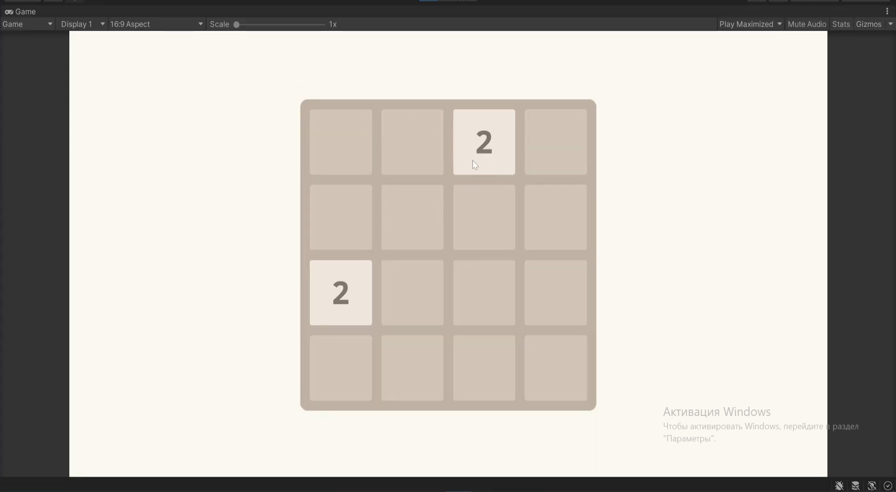

# Лабораторная работа: Заготовка игры 2048 (Unity)

Проект представляет собой базовую реализацию механик игры 2048 в Unity. На текущем этапе реализованы:
- Игровое поле 4x4
- Система клеток (`Cell`) с отслеживанием изменений
- Логика инициализации поля

## Особенности
- 🧩 Класс `Cell` с событиями `OnValueChanged` и `OnPositionChanged`
- 🎮 Класс `GameField` для управления сеткой
- 🖌️ Визуальное представление клеток через префабы
- 📡 Система событий для реактивного обновления UI

## Структура проекта
```bash
Assets/
├── Scripts/
│   ├── Core/
│   │   ├── Cell.cs          # Логика клетки
│   │   ├── GameField.cs     # Управление игровым полем
│   │   └── CellView.cs      # Визуальное представление клетки
│   └── ...
├── Prefabs/
│   └── Cell.prefab          # Префаб клетки
└── Scenes/
    └── MainScene.unity      # Основная сцена
```

## Пример игрового поля

 
